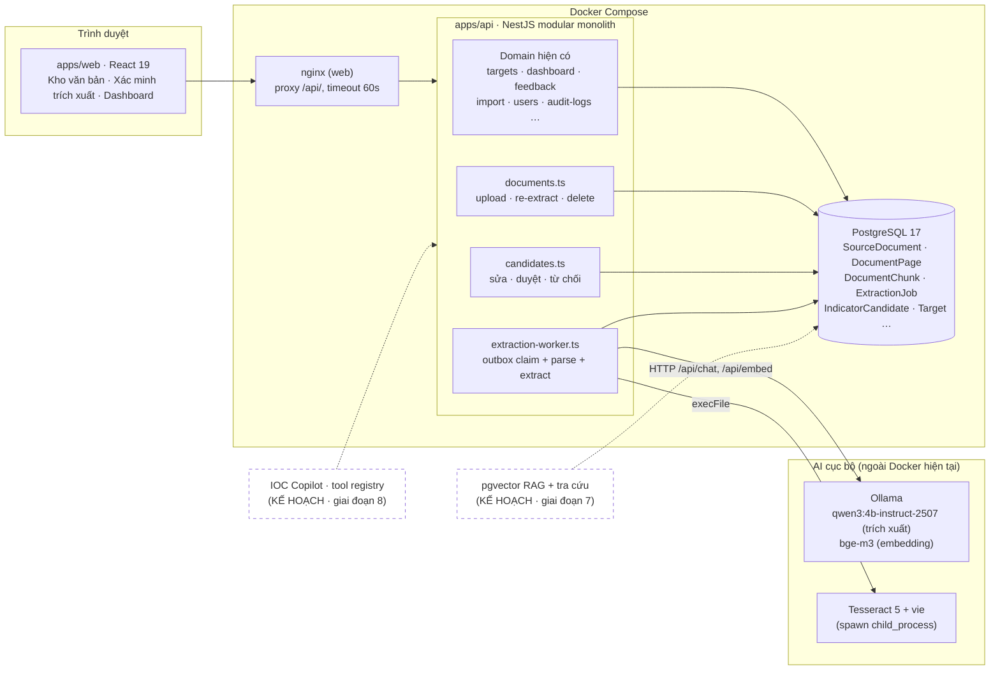
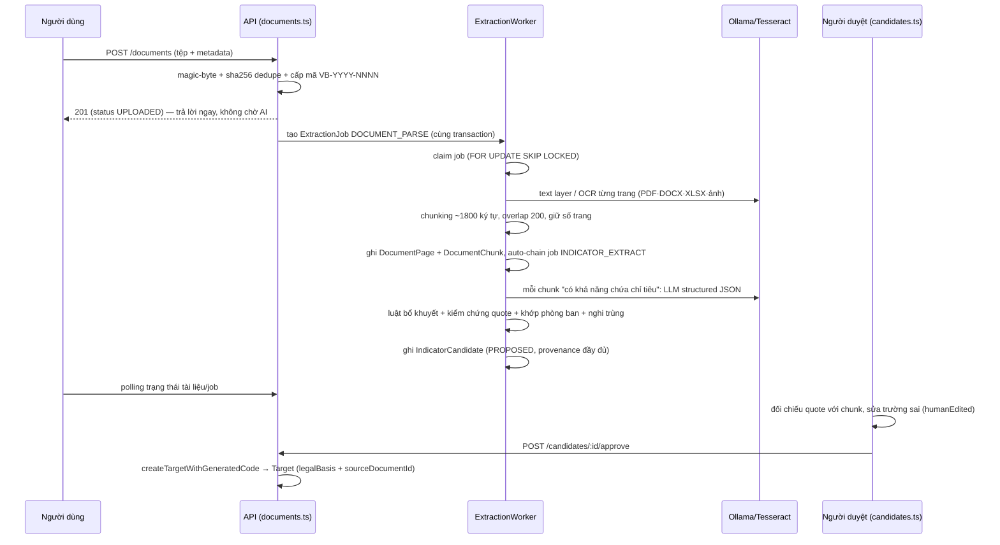

# Kiến trúc hệ thống (kèm lớp AI)

Kiến trúc nền: monorepo npm workspaces — `apps/api` (NestJS 11 + Prisma 6, **modular monolith một module phẳng**: mỗi domain = 1 file controller), `apps/web` (React 19 + Vite), PostgreSQL 17, Docker Compose 3 service. Lớp AI mới bổ sung vào chính monolith này theo quyết định D-001 (`DECISIONS.md`).

## 1. Sơ đồ thành phần

Mọi lời gọi model đi qua `OllamaService` (`apps/api/src/ollama.ts`) để thống nhất cấu hình, timeout và bảo đảm không log nội dung tài liệu.

## 2. Pipeline bất đồng bộ: upload → duyệt

Các bước đánh số: (1) upload đồng bộ chỉ làm validate + lưu; (2) parse; (3) chunk; (4) tự nối job trích xuất; (5) hybrid rule+LLM; (6) ứng viên PROPOSED; (7) người xác minh; (8) duyệt tạo Target có provenance; (9) chỉ tiêu xuất hiện trên Danh mục + Dashboard như mọi Target khác.

## 3. Mô hình worker outbox-claim

`ExtractionJob` nhân bản mô hình `MailOutbox` đã kiểm chứng trong repo (quyết định D-004):

- **Claim nguyên tử**: một câu SQL `FOR UPDATE SKIP LOCKED` chọn job PENDING đến hạn (hoặc PROCESSING có `lockedAt` quá lease) rồi UPDATE sang PROCESSING kèm `lockedBy` = workerId — nhiều API instance chạy song song không tranh nhau job.
- **Lease 10 phút** (dài hơn mail vì job AI chạy hàng phút): API restart giữa chừng thì job được claim lại sau khi lease hết hạn, không mất job.
- **Backoff mũ**: thất bại lần n chờ `20s × 2^(n-1)` (trần 30 phút) trước lần thử tiếp.
- **DEAD_LETTER**: quá `EXTRACTION_MAX_ATTEMPTS` (mặc định 3) job bị chuyển DEAD_LETTER; job parse chết hẳn đồng thời đánh dấu tài liệu FAILED để người dùng biết.
- **Single-flight**: worker trong tiến trình API, mỗi vòng poll (mặc định 4s, `timer.unref()`) chỉ xử lý 1 job — phù hợp job nặng, tránh chiếm hết GPU/RAM.

## 4. Vì sao bất đồng bộ

- nginx của bản triển khai hiện tại có `proxy_read_timeout 60s` — mọi endpoint đồng bộ chạy lâu sẽ đứt kết nối.
- LLM local chạy ~8–10 tok/s (E-001): một chunk mất 50–64 giây, một tài liệu 5–10 trang mất 3–10 phút — không thể giữ HTTP request.
- Upload vì vậy chỉ validate + lưu + tạo job rồi trả lời ngay; frontend theo dõi bằng polling trạng thái. Người dùng tiếp tục làm việc khác trong lúc AI xử lý.

## 5. Ranh giới tin cậy (trust boundaries)

1. **Tệp tải lên**: không tin MIME client — nhận diện bằng magic-byte (kể cả soi entry trong container ZIP để phân biệt DOCX/XLSX), MIME lưu = MIME phát hiện, giới hạn 25MB, dedupe SHA-256.
2. **Nội dung tài liệu**: là DỮ LIỆU, không phải mệnh lệnh — được kẹp giữa delimiter trong prompt, system prompt quy định bỏ qua mọi câu ra lệnh nằm trong văn bản; pipeline trích xuất không có khả năng thực thi tool.
3. **Đầu ra LLM**: cũng là dữ liệu không đáng tin — `sanitizeLlmIndicators` validate từng trường (độ dài, kiểu số, enum, khoảng ngày/năm), kiểm chứng `sourceQuote` bằng string-match với chunk (không khớp ⇒ cảnh báo + hạ trần confidence 0.4) trước khi ghi DB.
4. **Ứng viên → dữ liệu chính thức**: chỉ vượt ranh giới qua người duyệt (ADMIN), tái dùng trust-boundary preview→duyệt→apply của Import Excel; tạo Target qua đúng `createTargetWithGeneratedCode` dùng chung với luồng thủ công.

Chi tiết threat model: [SECURITY.md](SECURITY.md).

## 6. Suy giảm có kiểm soát (graceful degradation)

Trước mỗi job trích xuất, worker kiểm tra `OllamaService.isAvailable()` (timeout 3s). Khi Ollama tắt:

- Pipeline vẫn chạy hoàn toàn bằng rule-based (`extraction-rules.ts`), job ghi `promptVersion = 'rule-only'`, ứng viên gắn method RULE_BASED.
- LLM lỗi ở một chunk riêng lẻ chỉ bỏ qua chunk đó (log cảnh báo không kèm nội dung), không đánh hỏng cả job.
- Heuristic `chunkLikelyHasIndicators` lọc trước để chỉ gọi LLM với chunk có khả năng chứa chỉ tiêu — tiết kiệm GPU.

## 7. Thành phần tương lai (kế hoạch — chưa triển khai)

- **RAG + pgvector** (giai đoạn 7): thêm cột vector cho `DocumentChunk` (schema đã chừa sẵn chỗ), đổi image Postgres sang `pgvector/pgvector:pg17` kèm quy trình dump/restore (D-005); hybrid search FTS + vector + citation; màn hình tra cứu kho tri thức.
- **IOC Copilot** (giai đoạn 8): tool registry có schema (searchDocuments, queryMetrics, createIndicators…), agent loop Qwen3 tool-calling — đọc trực tiếp, ghi phải qua preview + xác nhận, ghi AgentAction/audit. Cấm LLM sinh SQL tự do (quy tắc bất biến trong `CLAUDE.md`).
- **PROGRESS_UPDATE từ báo cáo** (giai đoạn 9): enum `CandidateKind.PROGRESS_UPDATE` đã có sẵn trong schema, luồng trích xuất giá trị thực hiện và duyệt tạo ProgressUpdate chưa hiện thực.
- **Speech-to-text tiếng Việt** (giai đoạn 10): đánh giá whisper.cpp/faster-whisper local.
